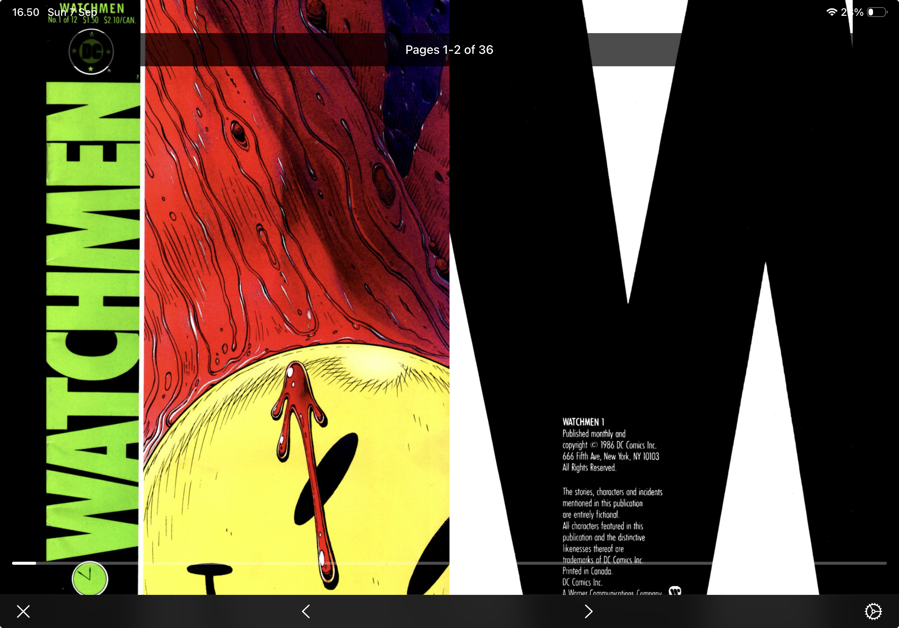

# Matopoei

A comic book reader for iPad and iPhone.

**⚠️ This project is currently under development.**

## App Icon

## Screenshots

### Library View

### Reading Interface  

### Folder Organization

## Features

- Read CBZ and CBR comic archives
- Organize comics in folders
- Single and double page reading modes
- Reading progress tracking
- Zoom and pan support
- File import from document picker
- Toggle visibility of system folders

## Supported Formats

- CBZ (Comic Book ZIP)
- CBR support coming soon

## Requirements

- iOS 15.6+
- iPadOS 15.6+
- Xcode 12.0+

## Installation

1. Clone this repository `git clone https://github.com/patricknelwan/Matopoei.git`
2. Open `Matopoei.xcodeproj` in Xcode
3. Build and run on your iOS device or simulator

## Usage

1. Import comics using the + button
2. Tap on a comic to start reading
3. Use tap zones to navigate pages
4. Long press for context menu options
5. Create folders to organize your library
